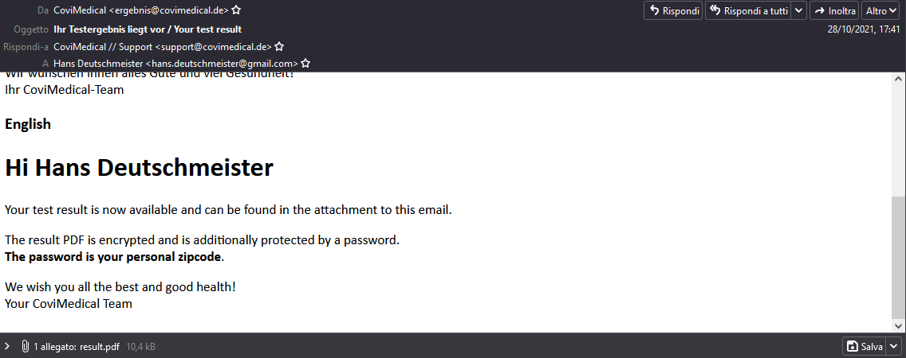
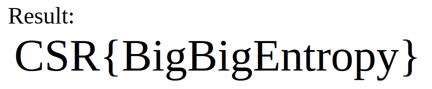

# Result 

## Description

I really want to know my test result, but unfortunately its additionally protected. I attached the [email](Test_Result.eml). Maybe you can help?

## Solution

First of all let's open the email



There is an enctrypted pdf file

```
The password is your personal zipcode.
```

This hint about the password can simplify the challenge. On [Wikipedia](https://en.wikipedia.org/wiki/List_of_postal_codes_in_Germany) we found that in Germany there are approximately 100000 zip code, so let's create e list with all these zip code

```python
with open("list.txt", "w") as f:
    for i in range(0,100000):
        print(i, file=f)
```

Now we can extract the hash with john and crack it

```console
$ ./pdf2john.pl result.pdf > pdf.hash

$ cat pdf.hash
result.pdf:$pdf$5*6*256*-4*1*16*a7e7f3044ae023f1d1fac448bf25592c*48*67171ef681ef91ed5bea716fa5eceda89b8659e1e7e4c5b810be37befb1ddd6ccc0217015a1eebce2c84e57607d22225*48*9b5a9e500fb87e9d4171e22fa77eb5a72ba857d2e2eaa4674ec8ed69831c77fdf400be271c304f6875dd1c5272a3fef0*32*e6e5cbe1bef4ba12e74a43e8a079970ed93664333955e76d22396fe69367d3fc*32*3de89fe5d937cf8a0b1105dd7c60a0c24bd3ca0e815b59cd02a59581d36165be

$ john pdf.hash --wordlist=list.txt
Using default input encoding: UTF-8
Loaded 1 password hash (PDF [MD5 SHA2 RC4/AES 32/64])
Cost 1 (revision) is 6 for all loaded hashes
Will run 8 OpenMP threads
Press 'q' or Ctrl-C to abort, almost any other key for status
73760            (result.pdf)
1g 0:00:00:12 DONE (2021-11-27 17:36) 0.07782g/s 5757p/s 5757c/s 5757C/s 73728..73983
Use the "--show --format=PDF" options to display all of the cracked passwords reliably
Session completed
```

All that remains is to use `73760` as a password to open the file 



#### **FLAG >>** `CSR{BigBigEntropy}`