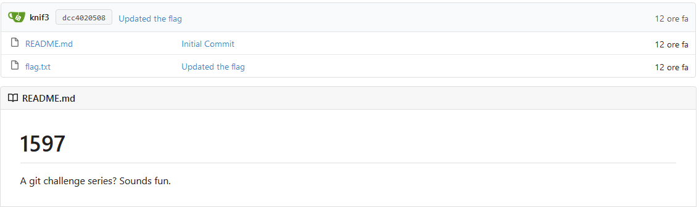
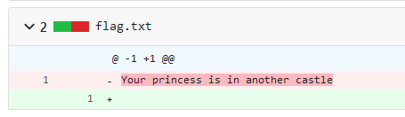
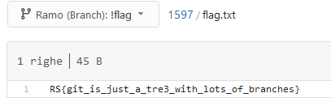

# 1597

## Decription

... as in https://xkcd.com/1597/

http://git.ritsec.club:7000/1597.git/

## Solution

I don't really like working from the terminal, se let's import this repo into Gitea

In the master branch we have this

The `flag.txt` file is empty, so maybe someone modified it, let's see the commit history

No flags, but this sounds so much like a way of saying to go to check out the other branches

#### **FLAG >>** `RS{git_is_just_a_tre3_with_lots_of_branches}`