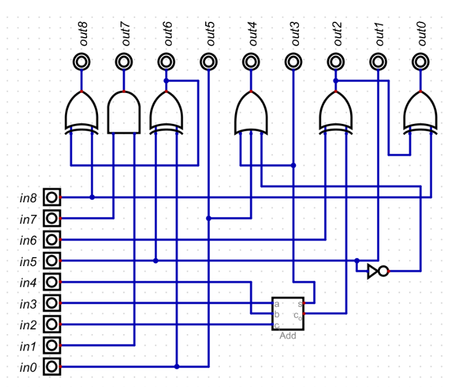

# Misc 100


## Description


Yeah, this is your circuit.
The first input to apply is the binary number 000000000.
in0 and out0 are the least significant bits.
in8 and out8 are the most significant bits.
All the values are intended as big-endian.
Every time you present an input, such a circuit elaborates an output.
To obtain the next output, present in input the past output.
You will obtain Ah successive outputs, that you can use to query the following
memory map to obtain the final result.
Oh, remember to add the phlag prefix and postfix to make all correct ;)

```
addr
values
0x000 a_cdefaijkltmnop
0x010 wzstueabez012000
0x020 67890ABCDEFGHIJK
0x030 nooodtdvw000eta?
0x040 T!VW00Y!ETA?*-+/
0x050 {}[]=&%£"!()abcd
0x060 efghijklmnopqrsA
0x070 BCDEFGHIJKLNMuuu
0x080 vwxipsilonnnnnnz
0x090 %%/9876543210|!"
0x0A0 £$ohdear!%&/((((
0x0B0 )*;:_AAAABSIDEOW
0x0C0 abcdefghijklmnop
0x0D0 qrstuvwxyz012345
0x0E0 678?8?8?8?9!!!!!
0x0F0 EGIN.CERTIFICATE
0x100 a_cdefaijkltmnop
0x110 wzstueabez012000
0x120 67890ABCDEFGHIJK
0x130 nooodtdvw000eta?
0x140 T!VW00Y!ETA?*-+/
0x150 {}[]=&%£"!()abcd
0x160 efghijklmnopqrsA
0x170 BCDEFGHIJKLNMuuu
0x180 vwxipsilonnnnnnz
0x190 %%/9876543210|!"
0x1A0 £$ohdear!%&/((((
0x1B0 )*;:_AAAABSIDEOW
0x1C0 abcdefghijklmnop
0x1D0 qrstuvwxyz012345
0x1E0 678?8?8?8?9!!!!!
0x1F0 EGIN.CERTIFICATE
```


## Solution
Pass 000000000 into the circuit and take note of the output. Pass the output as input to the circuit. Repeat 10 times. Use the 10 outputs as indexes in the map and obtain the flag's characters.
```
bin		hex	char
000000000       0x000
000010000       0x010   w
000011000       0x018   e
000010101       0x015   e
101110101       0x175   G
100110011       0x133   o
100111011       0x13B   0
100110110       0x136   d
001000110       0x046   Y
000011101       0x01D   0
101111101       0x17D   u
```

#### **FLAG >>** `{FLG:weeGo0dY0u}`
