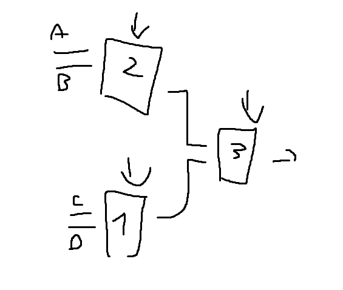

# Minetest 2 - MUX

## Description

Join the server to checkout the minetest challenges. You do not need to solve one before the other!

https://www.minetest.net/

167.71.246.192:30000

## Solution

We neet to decode all 8 triple MUX, the selection of these 3 MUX create our 3 bit to insert into the flag

MUX 1 -> 101
MUX 2 -> 111
MUX 3 -> 100
MUX 4 -> 000
MUX 5 -> 011
MUX 6 -> 011
MUX 7 -> 111
MUX 8 -> 000

#### **FLAG >>** `UMDCTF{101111100000011011111000}`