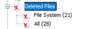

# Renzik's Case

## Description

My friend deleted important documents off of my flash drive, can you help me find them?

Note: The flag can be submitted with or without the hiphen ex. UMDCTF-{flag} or UMDCTF{}

https://drive.google.com/file/d/1VmUyHJqU11E0UE7OYTPYV3U2yVh2qL5g/view?usp=sharing

## Solution

We get only a `.img` file

Because we need to recover some files let's try with `Autopsy`

#### **FLAG >>** `UMDCTF-{Sn00p1N9-L1K3_4_Sl317h!}`
