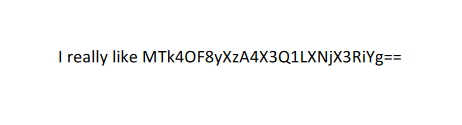
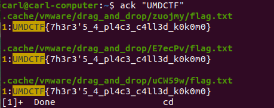

# Still Cruisin'

## Description

I want to join the Beach Boys, but they seem to keep everything locked down pretty tight. Can you help me get in?

https://drive.google.com/drive/folders/1oP_YHamhh9X9ewjwLMSxb6-7cX0BjTLe?usp=sharing

## Solution

Both files are password protected, let's try to crack it with john 

```console
$ ./pdf2john.pl production_notes.pdf > hash

$ ./john --wordlist=rockyou.txt hash

$ ./john --wordlist=rockyou.txt hash
Using default input encoding: UTF-8
Loaded 1 password hash (PDF [MD5 SHA2 RC4/AES 32/64])
Cost 1 (revision) is 6 for all loaded hashes
Will run 8 OpenMP threads
Press 'q' or Ctrl-C to abort, almost any other key for status
tropical!        (production_notes.pdf)
1g 0:00:01:14 DONE (2022-03-06 01:49) 0.01333g/s 4407p/s 4407c/s 4407C/s twinny1..triplep
Use the "--show --format=PDF" options to display all of the cracked passwords reliably
Session completed
```

And here is it the password `tropical!`

In the PDF file we found this



From `base64` => `1988_2_08_t5-sc_tbb`

Inside the `ZIP` we can found `sticky_note.txt`, and inside this file there is the computer's password (`groovy88`)

Let's mount the `vmdk` with VMware and login using the password

I don't know if this was intentional, but searching for the `UMDCTF` give us the flag



#### **FLAG >>** `UMDCTF{7h3r3'5_4_pl4c3_c4ll3d_k0k0m0}`