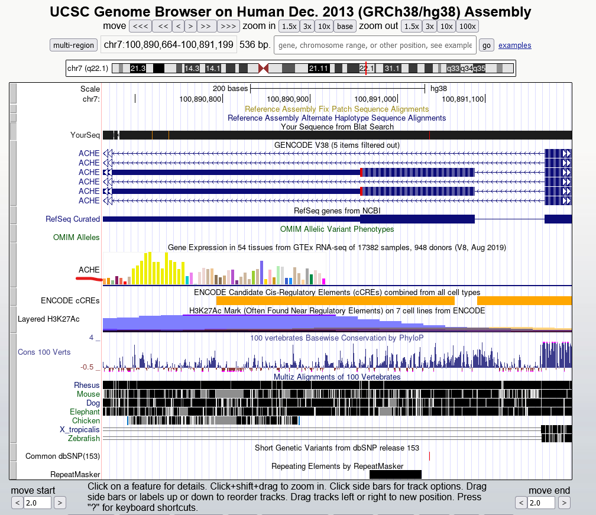
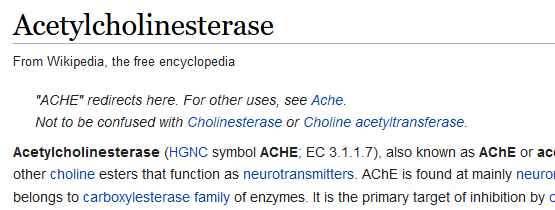

# Having a BLAST

## Description

Hi! We have just opened our first Lapland Bio Lab, where we are trying to build the toys of the future! (Ethics not included. We are thankfully not concerned about them, that's the Legal department's job!).

While scavenging through files, we have found this DNA sequence that contains a few exons from what the file says, a "homo sapiens gene that encodes the [REDACTED] enzyme". There is nothing more descriptive than that, huh. Can you find the enzyme encoded by this gene? We need this done by today. Thanks!

Attached DNA sequence:

```
CGCTTCCTCCCCAAATTGCTCAGCGCCACCGGTATGCAGGGGCCAGCGGGCAGCGGCTGGGAGGAGGGGAGTGGGAGCCCGCCAGGTGTAACCCCTCTCTTCTCCCCCTAGCCTCGGAGGCTCCCAGCACCTGCCCAGGCTTCACCCATGGGGAGGCTGCTCGGAGGCCCGGCCTCCCCCTGCCCCTCCTCCTCCTCCACCAGCTTCTCCTCCTCTTCCTCTCCCACCTCCGGCGGCTGTGAACACGGCCTCTTCCCCTACGGCCACAGGGGCCCCTCCTCTAATGAGTGGTCGGACCGTGGGGAAGGGCCCCACTCAGGGATCTCAGACCTAGTGCTCCCTTCCTCCTCAAACCGAGAGACTCACACTGGACAGGGCAGGAGGAGGGGGCCGTGCCTCCCACCCTTCTCAGGGACCCCCACGCCTTTGTTGTTTGAATGGAAATGGAAAAGCCAGTATTCTTTTTATAAAATTATCTTTTTGGAACCTGAGCCTGACATTGGGGGGAAGTGGGAGGCCGGACGGGTAGCACCCC
```

## Solution

We can search the sequence on [this](http://genome.ucsc.edu/cgi-bin/hgBlat?db=mm2) site 



We can now search for this `ACHE`



#### **FLAG >>** `X-MAS{acetylcholinesterase}`