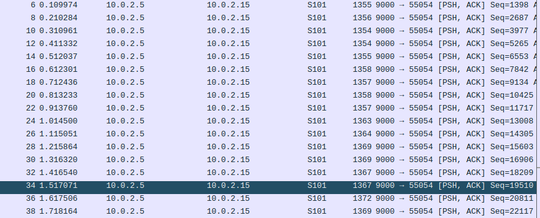
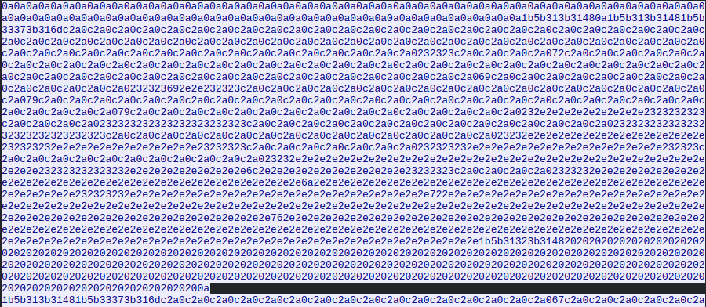
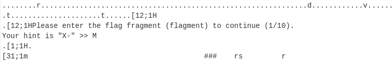

# Super Secret Communications 

## Description

Okay, the note's right here. Hold on... uh... Okay.

`You'll never discover our secrets! Our method is so secure you'll never get in! We've even given you a full packet capture of everything we sent! Do your worst, ELVES!`

Yeah, we don't know either. Just try to find the secret message.

## Solution

For this challenge we receive a [.pcap](./captured.pcap) file. Here, we find a unique TCP stream, but, by looking at the ASCII content, we would not find anything in this stream. Because of this, we need to switch to raw view. We'll see this stream of data:

By using Cyberchef, we can simply upload all the content of the stream and convert it from Hex. Here, by just scrolling a little bit, we'll find this kind of communication:

Now we could just rebuild the flag, putting together the hint and the user input.

#### **FLAG >>** `X-MAS{y0u_cr4CK4d_thE_c0d3!_afa03819def2f}`