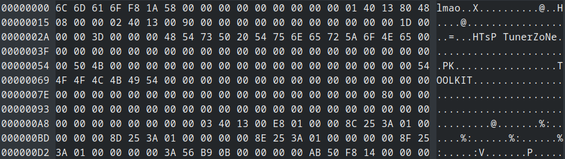
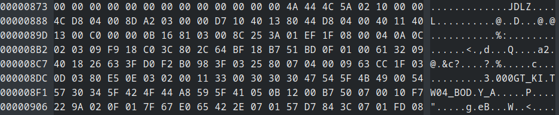
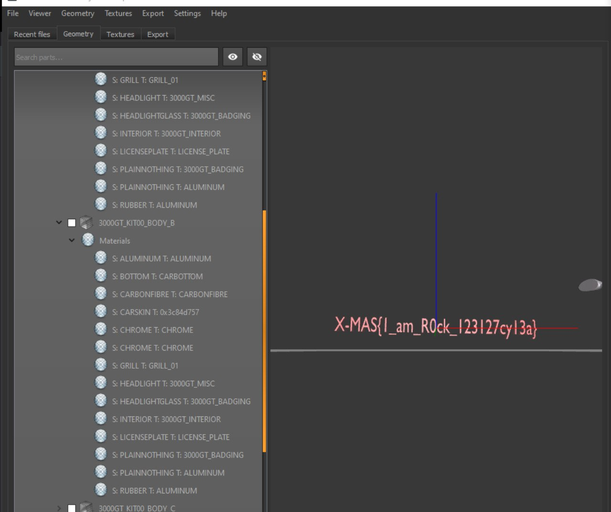

# Underground Forensics 

## Description

```
[Incoming SMS Message]
From: Rachel
Subject: New File

Hey! I found this on my old hard drive. Files like these have been roaming the streets for almost two decades now, but this one seems to be broken in some way... Do you think you can bring it back to life?
```

## Solution

Firstly, a special thanks to `@MΛRC02U1F4A4`

Let's start with this challenge. We receive a [.bin](./UNK.BIN) file. I decide to use binwalk to understand what kind of data this file represents. As a result, we initially think it is an LZMA corrupt archive, because of a part of a file that resembles an LZMA header, thanks to a `5D` byte. This could be a good path since the beginning of the file was too much sus:



But, we are wrong. In fact, by consulting the content of the file with a Hex Editor (Ghex and HxD), we find that there are a lot of interesting `JDLZ` keywords.



By searching some information online, we understand that JDLZ is an Electronic Arts compression/decompression algorithm.
Moreover, we understand that that's a bin file related to Need For Speed underground 2 thanks to the challenge description. Rachel is an NFS U2 character, and in particular, the configuration file must be related to a car, since the file `has been roaming the streets`.
In addition to that, `3.000GT` resembles the name of the `Mitsubishi 3000GT`, a vehicle exclusively included in `underground 2`. 

At this point, this one must be the right path. For this, `@MΛRC02U1F4A4` gave me some bin files taken from the 3000GT NFS game folder, in particular, `TEXTURE.BIN` and `GEOMETRY.BIN`. 

The idea is to fix the header of the file, to open it in some ways and read the content. For this, we've found [NFS carToolkit](https://nfs-tools.blogspot.com/p/downloads.html), which is the most suitable software for NFS modding.

As expected, by trying to open the given bin file with this software, it doesn't open it. By opening an original game file, we would see all the textures or geometries of the given car. 

After too many hours, we understand that we should just change the `magic bytes` of the bin file, whose function is to define what kind of file we are working with. We try the `TEXTURE.BIN` magic bytes, nothing. The toolkit can't understand what's the game version. But, by replacing the `lmao` with the `GEOMETRY.BIN` magic bytes, the file gets opened, and the car model is shown. Here, by disabling some levels, we can find the flag:



#### **FLAG >>** `X-MAS{1_am_R0ck_123127cy13a}`