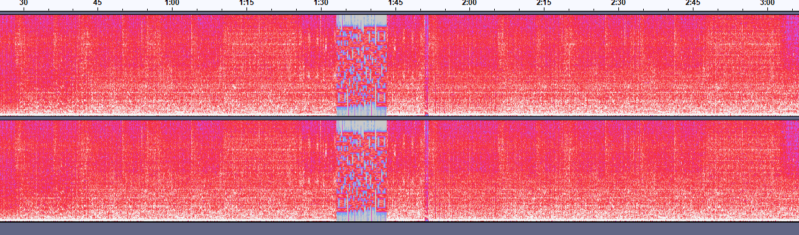
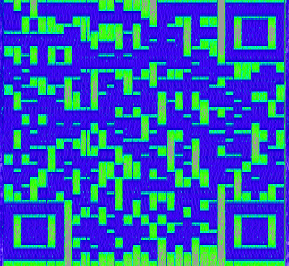
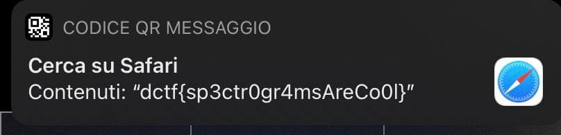

# Bad Apple

## Description

Someone stumbled upon this file in a secure server. What could it mean?

[Bad_Apple.mp4](Bad_Apple.mp4)

## Solution

Watching the video we hear a strange noise that starts at `1:33`, let's extract the audio using `ffmpeg` and try to open it with audacity 

At first glance, nothing is found, but observing the spectrogram we find a QR code

Let's try to improve the image

If we scan the QR code we get the flag

#### **FLAG >>** `dctf{sp3ctr0gr4msAreCo0l}`
