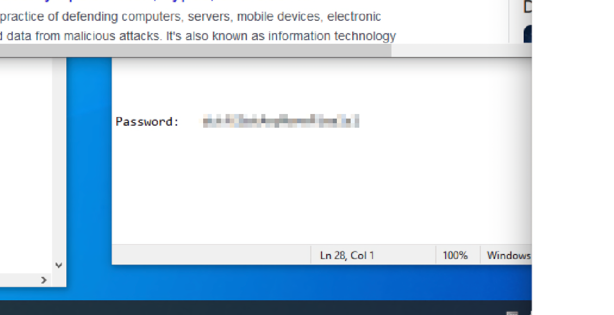

# Behind the scenes

## Description

Looks like a behind-the-scenes screenshot of the process behind this challenge was leaked. Can you use it to your advantage? (flag does not contain numbers)

[bts.png](bts.png)

## Solution

In the [bts.png](bts.png) we can find this that seems interesting



Maybe we can try [Depix](https://github.com/beurtschipper/Depix) to decode the string

First of all let's prepare the input file


Now let's decode it

```console
$ python depix.py -p /home/marco/dctf/pw_15px_2.png -s images/searchimages/debruinseq_notepad_Windows10_closeAndSpaced.png -o /home/marco/dctf/pw_out.png
INFO:root:Loading pixelated image from /home/marco/dctf/pw_15px_2.png
INFO:root:Loading search image from images/searchimages/debruinseq_notepad_Windows10_closeAndSpaced.png
INFO:root:Finding color rectangles from pixelated space
INFO:root:Found 108 same color rectangles
INFO:root:92 rectangles left after moot filter
INFO:root:Found 1 different rectangle sizes
INFO:root:Finding matches in search image
INFO:root:Scanning 92 blocks with size (5, 5)
INFO:root:Scanning in searchImage: 0/1674
INFO:root:Scanning in searchImage: 64/1674
INFO:root:Scanning in searchImage: 128/1674
INFO:root:Scanning in searchImage: 192/1674
INFO:root:Scanning in searchImage: 256/1674
INFO:root:Scanning in searchImage: 320/1674
INFO:root:Scanning in searchImage: 384/1674
INFO:root:Scanning in searchImage: 448/1674
INFO:root:Scanning in searchImage: 512/1674
INFO:root:Scanning in searchImage: 576/1674
INFO:root:Scanning in searchImage: 640/1674
INFO:root:Scanning in searchImage: 704/1674
INFO:root:Scanning in searchImage: 768/1674
INFO:root:Scanning in searchImage: 832/1674
INFO:root:Scanning in searchImage: 896/1674
INFO:root:Scanning in searchImage: 960/1674
INFO:root:Scanning in searchImage: 1024/1674
INFO:root:Scanning in searchImage: 1088/1674
INFO:root:Scanning in searchImage: 1152/1674
INFO:root:Scanning in searchImage: 1216/1674
INFO:root:Scanning in searchImage: 1280/1674
INFO:root:Scanning in searchImage: 1344/1674
INFO:root:Scanning in searchImage: 1408/1674
INFO:root:Scanning in searchImage: 1472/1674
INFO:root:Scanning in searchImage: 1536/1674
INFO:root:Scanning in searchImage: 1600/1674
INFO:root:Scanning in searchImage: 1664/1674
INFO:root:Removing blocks with no matches
INFO:root:Splitting single matches and multiple matches
INFO:root:[14 straight matches | 65 multiple matches]
INFO:root:Trying geometrical matches on single-match squares
INFO:root:[32 straight matches | 47 multiple matches]
INFO:root:Trying another pass on geometrical matches
INFO:root:[36 straight matches | 43 multiple matches]
INFO:root:Writing single match results to output
INFO:root:Writing average results for multiple matches to output
INFO:root:Saving output image to: /home/marco/dctf/pw_out.png
```


Here is it the flag in some not optimal way, after some try we get the flag

#### **FLAG >>** `dctf{GotAnyMorePixels}`