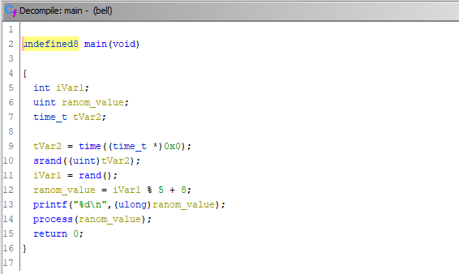
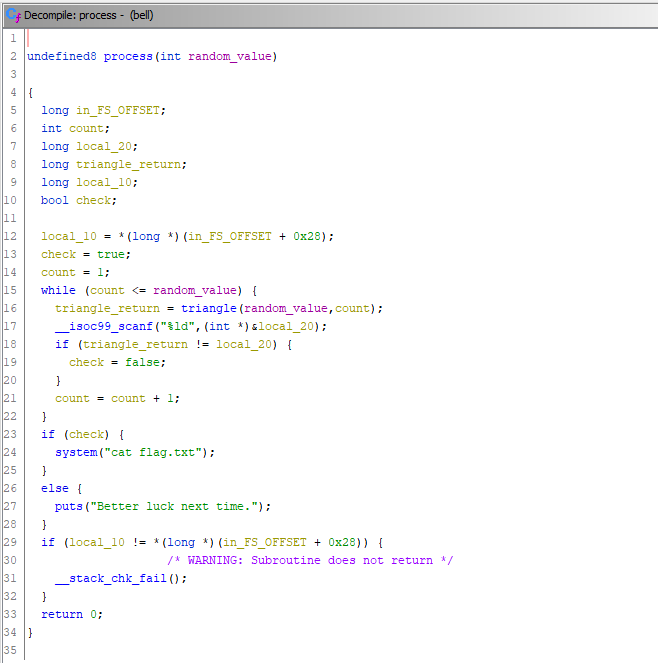
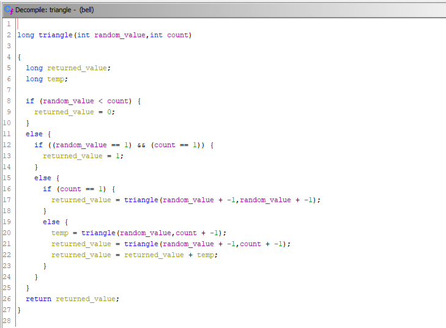

# Bell

## Description

Blaise's friends like triangles too!

`nc dctf-chall-bell.westeurope.azurecontainer.io 5311`

[bell](bell)

## Solution

If we connect to the service we get this

```console
$ nc dctf-chall-bell.westeurope.azurecontainer.io 5311
12
```

Maybe is better to analyze the file, we can use Ghidra



In the `main` we first get the number that we have seen before, after that a random number, `random_value`, is generated and passed to the `process` function



Here we have a loop that runs based on the `random_value`, the function `triangle` is also call and if the value returned is the same as the one entered by the user  all the `random_value` times, we get the flag



Inside the `triangle` function some count are made, nothing complicated, we can easily replicate it 

Let's write the code to solve the challenge

```python
from pwn import *

nc = remote('dctf-chall-bell.westeurope.azurecontainer.io', 5311)

x = int(nc.recvlineS())

def triangle(a, b):
    if a < b:
        return 0
    elif a == 1 and b == 1:
        return 1
    elif b == 1:
        return triangle(a - 1, a - 1)
    else:
        return triangle(a, b - 1) + triangle(a - 1, b - 1)

log.info(f"x: {x}")

for i in range(1, x + 1):
    nc.sendline(str(triangle(x, i)))

log.info(f"Flag: {nc.recvallS()}")
```

```console
[+] Opening connection to dctf-chall-bell.westeurope.azurecontainer.io on port 5311: Done
[*] x: 9
[+] Receiving all data: Done (35B)
[*] Closed connection to dctf-chall-bell.westeurope.azurecontainer.io port 5311
[*] Flag: dctf{f1rst_step_t0wards_b3ll_l4bs}
```

#### **FLAG >>** `dctf{f1rst_step_t0wards_b3ll_l4bs}`