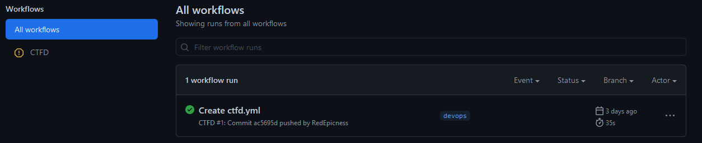
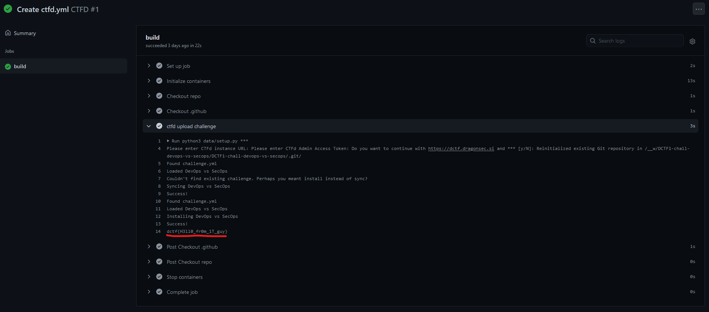

# DevOps vs SecOps

## Description

Automatization is amazing when it works, but it all comes at a cost... You have to be careful...

(URL not missing)

###### Hint -> What does automation and DevOps remind you of? For me thats CI/CD...

## Solution

Into the DragonSec `GitHub` page we can find the `DCTF1-chall-devops-vs-secops` [repository](https://github.com/DragonSecSI/DCTF1-chall-devops-vs-secops) \
Given the hint the first thing that came to my mind is to check the `Actions` tab

Let's search more deeper

#### **FLAG >>** `dctf{H3ll0_fr0m_1T_guy}`