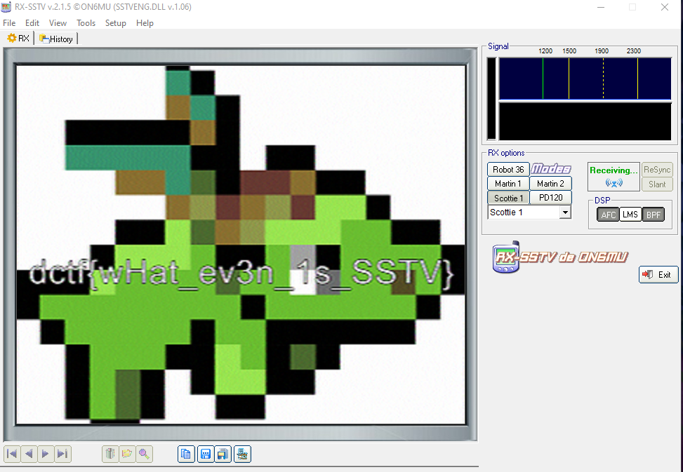

# Extraterrestrial Communication

## Description

Aliens have recently landed on the moon and are attempting to communicate with us. Can you figure out what they are trying to tell us?

## Solution

This is a particular challenge. We'll receive a `.mp3` file. By listening to the media, we'll understand that we are working with an encoded message. Fortunately, I immediately understood how to decode it. In fact, this was an image encoded using the mode of transmission `Scottie S1`. The technology, in general, is `SSTV: Slow Scan Television`: it's used by radio amateurs in order to transmit images. 

#### **FLAG >>** `dctf{wHat_ev3n_1s_SSTV}`
