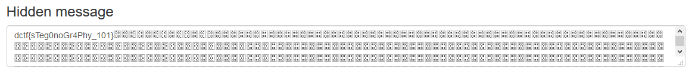

# Hidden message

## Description

This image looks familiar...

[fri.png](fri.png)

## Solution

Just use [Steganography Online](https://stylesuxx.github.io/steganography/)

#### **FLAG >>** `dctf{sTeg0noGr4Phy_101}`