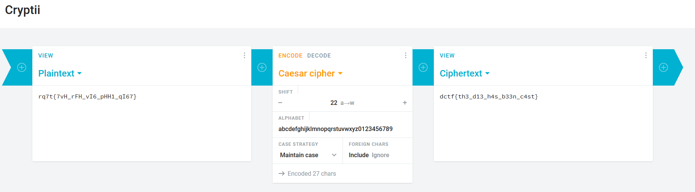

# Julius’ ancient script

## Description

I found this Ancient Roman **papyrus**. Could you decypher it for me?

[flag.txt](flag.txt)

## Solution

We can decode this with some [online tool](https://cryptii.com/pipes/caesar-cipher)

#### **FLAG >>** `dctf{th3_d13_h4s_b33n_c4st}`