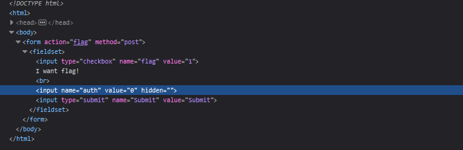

# Simple web

## Description

Time to warm up!
http://dctf1-chall-simple-web.westeurope.azurecontainer.io:8080

## Solution

If we check the `I want flag!` checkbox and hit `Submit` we get `Not authorized`, let's try to analyze the page

In the source code we found an `auth` value, just set it to `1` to get the flag

#### **FLAG >>** `dctf{w3b_c4n_b3_fun_r1ght?}`