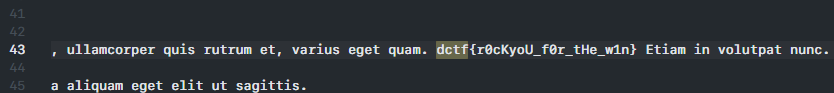

# Strong password

## Description

Zip file with a password. I wonder what the password could be?

[strong_password.zip](strong_password.zip)

###### Hint -> Don't use fcrackzip

## Solution

The zip file is protected with a password, let's try to crack it with john the ripper 

First thing let's extract the hash from the file

```console
$ ./zip2john strong_password.zip > strong_password_john
```

Now let's download the [rockyou wordlist](https://github.com/brannondorsey/naive-hashcat/releases/download/data/rockyou.txt), for more possibilities, and try to crack it

```console
$ ./john strong_password_john --wordlist=rockyou.txt --format=zip
Using default input encoding: UTF-8
Loaded 1 password hash (ZIP, WinZip [PBKDF2-SHA1 256/256 AVX2 8x])
Will run 8 OpenMP threads
Press 'q' or Ctrl-C to abort, almost any other key for status
Bo38AkRcE600X8DbK3600 (strong_password.zip/lorem_ipsum.txt)     
1g 0:00:01:40 DONE (2021-05-16 11:45) 0.009985g/s 113534p/s 113534c/s 113534C/s Bobo64..Badass650
Use the "--show" option to display all of the cracked passwords reliably
Session completed.
```

Now that we have the password, `Bo38AkRcE600X8DbK3600`, let's extract the file and search for the flag



#### **FLAG >>** `dctf{r0cKyoU_f0r_tHe_w1n}`
