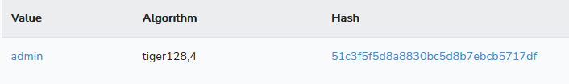
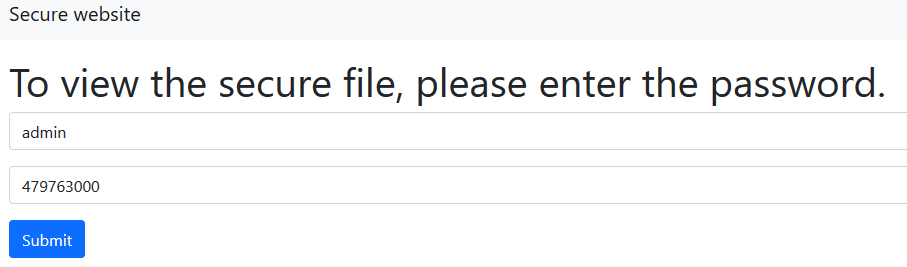
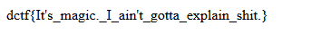

# Very secure website

## Description

Some students have built their most secure website ever. Can you spot their mistake?

http://dctf1-chall-very-secure-site.westeurope.azurecontainer.io/


## Solution

We have the source code of the webside

```php
 <?php
    if (isset($_GET['username']) and isset($_GET['password'])) {
        if (hash("tiger128,4", $_GET['username']) != "51c3f5f5d8a8830bc5d8b7ebcb5717df") {
            echo "Invalid username";
        }
        else if (hash("tiger128,4", $_GET['password']) == "0e132798983807237937411964085731") {
            $flag = fopen("flag.txt", "r") or die("Cannot open file");
            echo fread($flag, filesize("flag.txt"));
            fclose($flag);
        }
        else {
            echo "Try harder";
        }
    }
    else {
        echo "Invalid parameters";
    }
?> 
```

For the `username` we can use `admin`



For the `password` we need to match the hash, but in this case we can use a `magic hash`

```
Hash Type    | Hash Length    | “Magic” Number / String    | Magic Hashes
tiger128,4 	 | 32 	          | 479763000 	               | 00e05651056780370631793326323796 
```





#### **FLAG >>** `dctf{It's_magic._I_ain't_gotta_explain_shit.}`