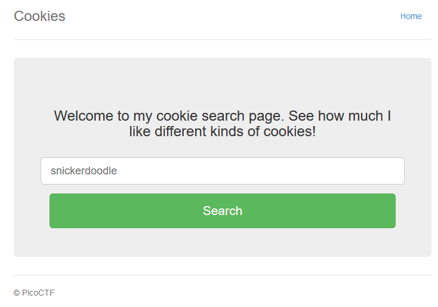

# Cookies

###### Who doesn't love cookies? Try to figure out the best one. http://mercury.picoctf.net:21485/

This is how the site looks like



If we send some random characters we get


Let's try with the default one


If we look at the cookie we have this

```
{
	"name": "0"
}
```

Maybe increment the number gives us other result

After some tries (a lot of tries xD), `"name": "18"` gives us the flag


#### **FLAG >>** `picoCTF{3v3ry1_l0v3s_c00k135_94190c8a}`

