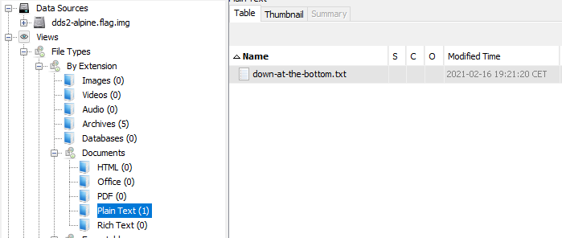

# Disk, disk, sleuth! II

###### All we know is the file with the flag is named `down-at-the-bottom.txt`... Disk image: [dds2-alpine.flag.img.gz](dds2-alpine.flag.img.gz)

This time we can use [Autopsy](https://www.autopsy.com/)

First of all extract the file and open it with [Autopsy](https://www.autopsy.com/)

From the description we know that we need to find the `down-at-the-bottom.txt` file

`Views > By Extension > Documents > Plaint Text`

And we have only one file: `down-at-the-bottom.txt`



Lets' open it

```
   _     _     _     _     _     _     _     _     _     _     _     _     _  
  / \   / \   / \   / \   / \   / \   / \   / \   / \   / \   / \   / \   / \ 
 ( p ) ( i ) ( c ) ( o ) ( C ) ( T ) ( F ) ( { ) ( f ) ( 0 ) ( r ) ( 3 ) ( n )
  \_/   \_/   \_/   \_/   \_/   \_/   \_/   \_/   \_/   \_/   \_/   \_/   \_/ 
   _     _     _     _     _     _     _     _     _     _     _     _     _  
  / \   / \   / \   / \   / \   / \   / \   / \   / \   / \   / \   / \   / \ 
 ( s ) ( 1 ) ( c ) ( 4 ) ( t ) ( 0 ) ( r ) ( _ ) ( n ) ( 0 ) ( v ) ( 1 ) ( c )
  \_/   \_/   \_/   \_/   \_/   \_/   \_/   \_/   \_/   \_/   \_/   \_/   \_/ 
   _     _     _     _     _     _     _     _     _     _     _  
  / \   / \   / \   / \   / \   / \   / \   / \   / \   / \   / \ 
 ( 3 ) ( _ ) ( 0 ) ( d ) ( 9 ) ( d ) ( 9 ) ( e ) ( c ) ( b ) ( } )
  \_/   \_/   \_/   \_/   \_/   \_/   \_/   \_/   \_/   \_/   \_/ 
```

Remove some line, substitute some characters and here is the flag

#### **FLAG >>** `picoCTF{f0r3ns1c4t0r_n0v1c3_0d9d9ecb}`
