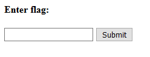
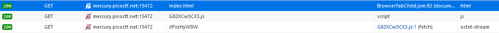

# Some Assembly Required 1

###### http://mercury.picoctf.net:15472/index.html

Connecting to the site we get these



If we try to enter some random character we get `Incorrect!` So maybe we can try to look at the file that we get when connection to the site



`index.html` is where we are now

`G82XCw5CX3.js` is some Javascript code, maybe we return here later if we need

`JIFxzHyW8W` seems useful

We can try with `strings` and see if contain some strings

```console
$ strings JIFxzHyW8W 
memory
__wasm_call_ctors
strcmp
check_flag
input
        copy_char
__dso_handle
__data_end
__global_base
__heap_base
__memory_base
__table_base
j!       
  F!!A
!" ! "q!# #
!% $ %q!& 
!( ' (q!) & )k!* 
!+ +
        q!
+picoCTF{c733fda95299a16681f37b3ff09f901c}
```

If we put this flag in the form it return `Correct!` so i think we have found it

#### **FLAG >>** `picoCTF{c733fda95299a16681f37b3ff09f901c}`