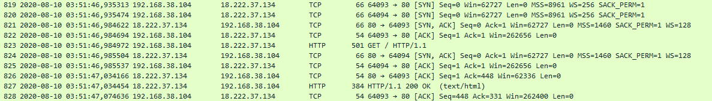

# Wireshark doo dooo do doo...

###### Can you find the flag? [shark1.pcapng](shark1.pcapng).

Rapidly analyzing the file it seems that in this part we can find something



So let's try to follow the http request

```
GET / HTTP/1.1
Host: 18.222.37.134
Connection: keep-alive
Cache-Control: max-age=0
Upgrade-Insecure-Requests: 1
User-Agent: Mozilla/5.0 (Windows NT 10.0; Win64; x64) AppleWebKit/537.36 (KHTML, like Gecko) Chrome/84.0.4147.105 Safari/537.36
Accept: text/html,application/xhtml+xml,application/xml;q=0.9,image/webp,image/apng,*/*;q=0.8,application/signed-exchange;v=b3;q=0.9
Accept-Encoding: gzip, deflate
Accept-Language: en-US,en;q=0.9

HTTP/1.1 200 OK
Date: Mon, 10 Aug 2020 01:51:45 GMT
Server: Apache/2.4.29 (Ubuntu)
Last-Modified: Fri, 07 Aug 2020 00:45:02 GMT
ETag: "2f-5ac3eea4fcf01"
Accept-Ranges: bytes
Content-Length: 47
Keep-Alive: timeout=5, max=100
Connection: Keep-Alive
Content-Type: text/html

Gur synt vf cvpbPGS{c33xno00_1_f33_h_qrnqorrs}
```

This seem like a Caesar cipher, we can bruteforce it with some [online tools](https://manansingh.github.io/Cryptolab-Offline/c2-brute-caesar.html)

```
1	FTQ RXMS UE BUOAOFR{B33WMN00_1_E33_G_PQMPNQQR}
2	ESP QWLR TD ATNZNEQ{A33VLM00_1_D33_F_OPLOMPPQ}
3	DRO PVKQ SC ZSMYMDP{Z33UKL00_1_C33_E_NOKNLOOP}
4	CQN OUJP RB YRLXLCO{Y33TJK00_1_B33_D_MNJMKNNO}
5	BPM NTIO QA XQKWKBN{X33SIJ00_1_A33_C_LMILJMMN}
6	AOL MSHN PZ WPJVJAM{W33RHI00_1_Z33_B_KLHKILLM}
7	ZNK LRGM OY VOIUIZL{V33QGH00_1_Y33_A_JKGJHKKL}
8	YMJ KQFL NX UNHTHYK{U33PFG00_1_X33_Z_IJFIGJJK}
9	XLI JPEK MW TMGSGXJ{T33OEF00_1_W33_Y_HIEHFIIJ}
10	WKH IODJ LV SLFRFWI{S33NDE00_1_V33_X_GHDGEHHI}
11	VJG HNCI KU RKEQEVH{R33MCD00_1_U33_W_FGCFDGGH}
12	UIF GMBH JT QJDPDUG{Q33LBC00_1_T33_V_EFBECFFG}
13	THE FLAG IS PICOCTF{P33KAB00_1_S33_U_DEADBEEF}
14	SGD EKZF HR OHBNBSE{O33JZA00_1_R33_T_CDZCADDE}
15	RFC DJYE GQ NGAMARD{N33IYZ00_1_Q33_S_BCYBZCCD}
16	QEB CIXD FP MFZLZQC{M33HXY00_1_P33_R_ABXAYBBC}
17	PDA BHWC EO LEYKYPB{L33GWX00_1_O33_Q_ZAWZXAAB}
18	OCZ AGVB DN KDXJXOA{K33FVW00_1_N33_P_YZVYWZZA}
19	NBY ZFUA CM JCWIWNZ{J33EUV00_1_M33_O_XYUXVYYZ}
20	MAX YETZ BL IBVHVMY{I33DTU00_1_L33_N_WXTWUXXY}
21	LZW XDSY AK HAUGULX{H33CST00_1_K33_M_VWSVTWWX}
22	KYV WCRX ZJ GZTFTKW{G33BRS00_1_J33_L_UVRUSVVW}
23	JXU VBQW YI FYSESJV{F33AQR00_1_I33_K_TUQTRUUV}
24	IWT UAPV XH EXRDRIU{E33ZPQ00_1_H33_J_STPSQTTU}
25	HVS TZOU WG DWQCQHT{D33YOP00_1_G33_I_RSORPSST}
```

#### **FLAG >>** `picoCTF{p33kab00_1_s33_u_deadbeef}`
