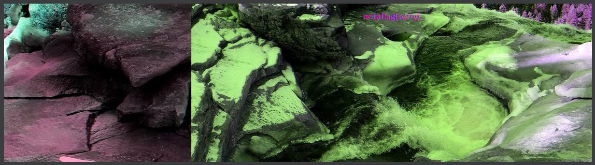
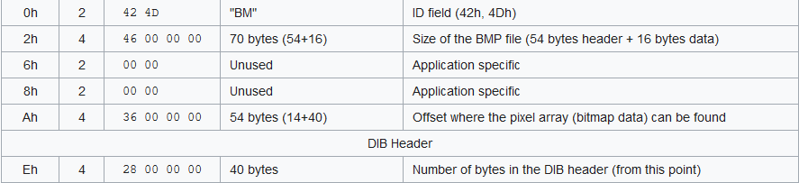
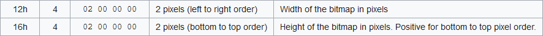
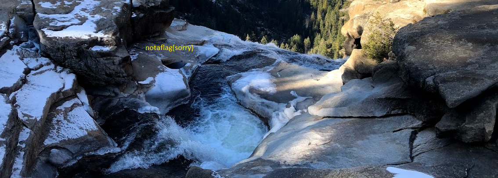

# tunn3l v1s10n

###### We found this [file](tunn3l_v1s10n). Recover the flag.

First of all let's try to understand what type of file is it

```console
$ file tunn3l_v1s10n 
tunn3l_v1s10n: data
```
```
Offset(h) 00 01 02 03 04 05 06 07 08 09 0A 0B 0C 0D 0E 0F
00000000  42 4D 8E 26 2C 00 00 00 00 00 BA D0 00 00 BA D0  BM.&,.....ºÐ..ºÐ
```
If we use an HEX reader we can see that this is a BMP file, so let's try to add the `.bmp` extension and open it



There seems to be something strange, maybe we can continue to analyze the HEX

```
Offset(h) 00 01 02 03 04 05 06 07 08 09 0A 0B 0C 0D 0E 0F
00000000  42 4D 8E 26 2C 00 00 00 00 00 BA D0 00 00 BA D0  BMŽ&,.....ºÐ..ºÐ
00000010  00 00 6E 04 00 00 32 01 00 00 01 00 18 00 00 00  ..n...2.........
00000020  00 00 58 26 2C 00 25 16 00 00 25 16 00 00 00 00  ..X&,.%...%.....
00000030  00 00 00 00 00 00 23 1A 17 27 1E 1B 29 20 1D 2A  ......#..'..) .*
```



Using to table we can find on [Wikipedia](https://en.wikipedia.org/wiki/BMP_file_format) you may notice that there is something wrong with the fields `Ah` and `Eh` which in the file are `BAD00000`, bad...

Let's try to put in the real value


Now we have a real image that we can open with no problem. First thing that came to my mind was to use `stegsolve.jar` but I didn't find anything so maybe the best way is to continue look a the HEX

Looking at the _Size of the BMP file_ we have `2893454 byte`, but, based on the image resolution `(1134 x 306)` we should have a `1041012 byte` image, so maybe there is some part that is hide somewhere

Let's try to change the image resolution in the HEX and see what happen



If we add `100px` in heigh this happen



```
Offset(h) 00 01 02 03 04 05 06 07 08 09 0A 0B 0C 0D 0E 0F
00000000  42 4D 8E 26 2C 00 00 00 00 00 36 00 00 00 28 00  BMŽ&,.....6...(.
00000010  00 00 6E 04 00 00 96 01 00 00 01 00 18 00 00 00  ..n...–.........
```

So let's try to add the maximum value that we can. Based on some quick calculation `850px` of total height should be ok

```
Offset(h) 00 01 02 03 04 05 06 07 08 09 0A 0B 0C 0D 0E 0F
00000000  42 4D 8E 26 2C 00 00 00 00 00 36 00 00 00 28 00  BMŽ&,.....6...(.
00000010  00 00 6E 04 00 00 52 03 00 00 01 00 18 00 00 00  ..n...R.........
```


#### **FLAG >>** `picoCTF{qu1t3_a_v13w_2020}`


