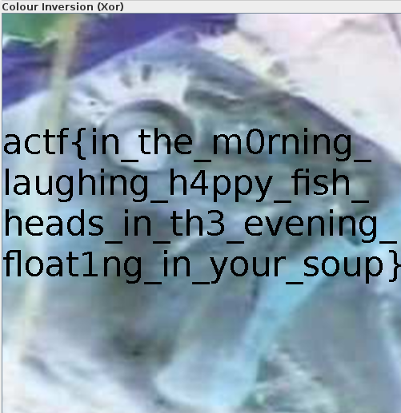

# Fish

## Description

Oh, fish! My [dinner](fish.png) has turned transparent again. What will I eat now that I can't eat that yummy, yummy, fish head, mmmmmm head of fish mm so good...

## Solution

Let's try to use `stegsolve`

#### **FLAG >>** `actf{in_the_m0rning_laughing_h4ppy_fish_heads_in_th3_evening_float1ng_in_your_soup}`