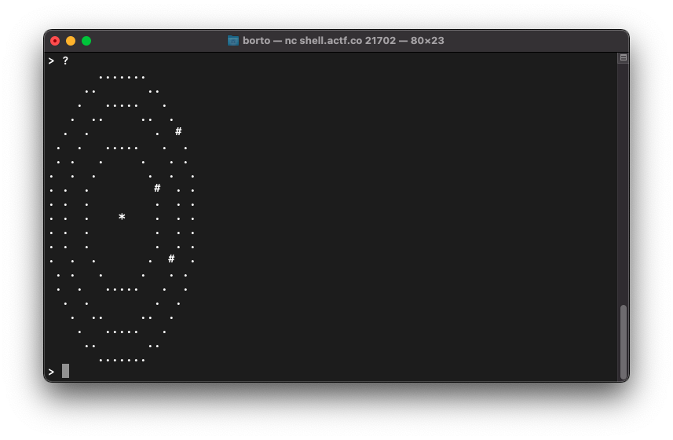

# Lockpicking

## Descrizione

Clam wanted to have a lockpicking competition but decided against it. So, he settled for a digital lockpicking competition instead.

Find it on the shell server at `/problems/2021/lockpicking` or over netcat at `nc shell.actf.co 21702`.

## Soluzione

Aprendo netcat da terminale appare quello che sembra un lucchetto a combinazione. 

Il lucchetto è formato da tre canali e qualcosa che non ho ben capito al centro.

Disassemblando l'eseguibile si deduce che i tre canali possono essere incrementati o decrementati rispettivamente con `i`, `m`, `o` e `I`, `M`, `O`, mentre il coso al centro si può attivare o disattivare con `!`.

L'input che genera la flag è:
`iiiiiiMMMMMMMooooooooooooo!iiimmmmmmmmmmmmmmmOOOOOO!oiiiiiiiiiiiiimmmO!!IIIIIIIIIIIIIIIImmmmmmmmmmmmmmmmmmmmmmmmmmooooooIIIIIImmmmmmmOOOOOOOOOOOOO`

#### **FLAG >>** `actf{this_is_how_lockpicking_works_right}`