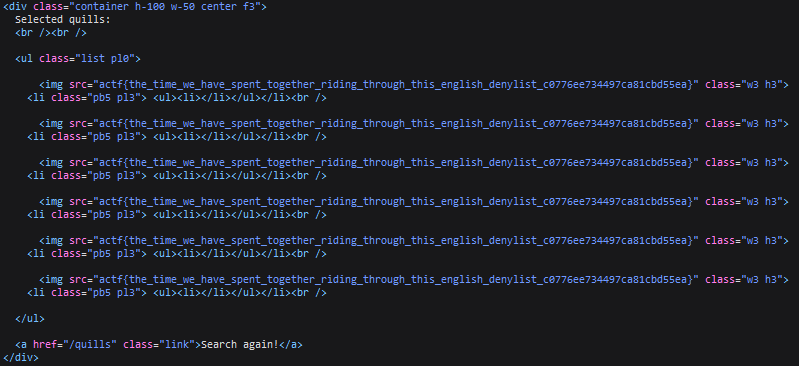

# Sea of Quills 2

## Description

A little bird told me my original quills store was vulnerable to illegal hacking! I've fixed [my store now](https://seaofquills-two.2021.chall.actf.co/) though, and now it should be impossible to hack!

[Source](app.rb)


## Solution

For the pre analysis check [this](https://github.com/K1nd4SUS/CTF-Writeups/tree/main/%C3%A5ngstromCTF_2021/Sea%20of%20Quills)

Compared to the other level we find two differences 

The word `flag` is in the blacklist

```ruby
blacklist = ["-", "/", ";", "'", "\"", "flag"]
```

The query we need to inject must not exceed 24 characters 

```ruby
if cols.length > 24 || !/^[0-9]+$/.match?(lim) || !/^[0-9]+$/.match?(off)
		return "bad, no quills for you!"
	end
```

For the first requirement we can use the world `FLAGTABLE` because the program does not filter uppercase characters, while for the second requirement we can write the query in this way 

```sql
(SELECT* FROM FLAGTABLE)
```



#### **FLAG >>** `actf{the_time_we_have_spent_together_riding_through_this_english_denylist_c0776ee734497ca81cbd55ea}`