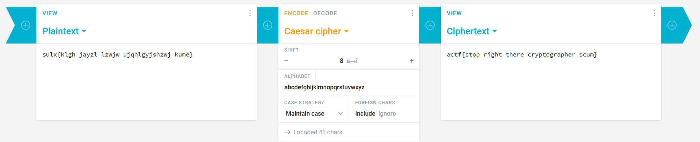

# Caesar and Desister

## Description

After making dumb jokes about cryptography to all his classmates, clam got a cease and desist filed against him! When questioned in court, his only comment was "clam's confounding Caesar cipher creates confusing cryptographic challenges." Needless to say, the judge wasn't very happy. Clam was sentenced to 5 years of making dumb Caesar cipher challenges. Here's one of them: `sulx{klgh_jayzl_lzwjw_ujqhlgyjshzwj_kume}`.

## Solution

Just Caesar cipher

  

#### **FLAG >>** `actf{stop_right_there_cryptographer_scum}`