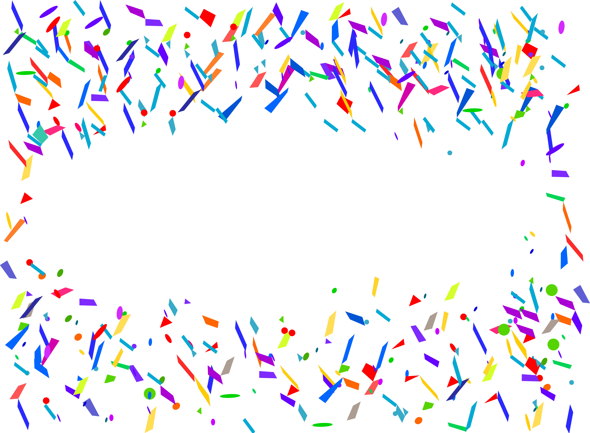

# Confetti

## Description

"From the sky, drop like confetti All eyes on me, so V.I.P All of my dreams, from the sky, drop like confetti" - Little Mix [confetti.png](confetti.png)

## Solution

This seems like a stego challenge so let's try some of the usal tools.

We notice thate inside the `hex` there are more than one images

```console
$ zsteg confetti.png
[?] 3180408 bytes of extra data after image end (IEND), offset = 0xec2ab
extradata:0         .. file: PNG image data, 3971 x 2918, 8-bit/color RGBA, non-interlaced
    00000000: 89 50 4e 47 0d 0a 1a 0a  00 00 00 0d 49 48 44 52  |.PNG........IHDR|
    00000010: 00 00 0f 83 00 00 0b 66  08 06 00 00 00 79 eb 82  |.......f.....y..|
    00000020: 6b 00 00 00 04 73 42 49  54 08 08 08 08 7c 08 64  |k....sBIT....|.d|
    00000030: 88 00 00 00 09 70 48 59  73 00 00 03 d1 00 00 03  |.....pHYs.......|
    00000040: d1 01 98 8a 89 b4 00 00  00 19 74 45 58 74 53 6f  |..........tEXtSo|
    00000050: 66 74 77 61 72 65 00 77  77 77 2e 69 6e 6b 73 63  |ftware.www.inksc|
    00000060: 61 70 65 2e 6f 72 67 9b  ee 3c 1a 00 00 20 00 49  |ape.org..<... .I|
    00000070: 44 41 54 78 9c ec dd 67  7c 54 65 de c6 f1 eb 4c  |DATx...g|Te....L|
    00000080: c9 cc a4 91 0e a1 97 10  48 42 93 5e 97 88 80 a0  |........HB.^....|
    00000090: e2 82 6b b0 20 48 0d 28  52 15 04 6c ac 15 15 57  |..k. H.(R..l...W|
    000000a0: ec 80 58 d7 b2 86 5d fb  ea ae ba ea 8a 65 dd 05  |..X...]......e..|
    000000b0: 7d 94 04 ec bd b3 76 90  9a dc cf 0b c4 55 69 29  |}.....v......Ui)|
    000000c0: 33 e7 9e 99 fc be af 96  99 73 ee eb fa e8 4a ce  |3........s....J.|
    000000d0: 64 ce ff dc 12 00 00 88  5f b3 2f eb a7 d9 57 16  |d......._./...W.|
    000000e0: db ae 01 fc 5a 7a fa d4  23 a4 e2 a0 ed 1e 00 00  |....Zz..#.......|
    000000f0: 00 00 00 00 00 00 00 00  00 00 00 00 00 00 00 00  |................|
meta Software       .. text: "www.inkscape.org"
imagedata           .. text: "D\"!!sz$$"
```

The image we see is repeated some times, let's extract the other images inside this file



#### **FLAG >>** `actf{confetti_4_u}`