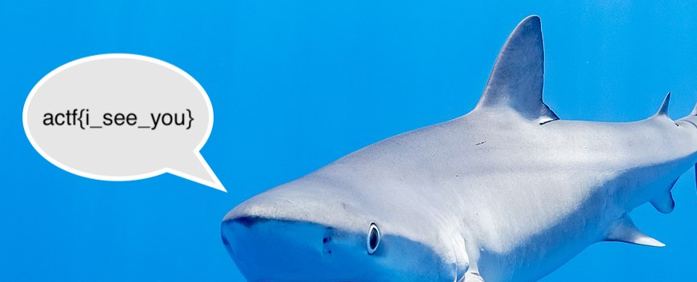

# Shark 2

## Description

My friend hasn't [learned](shark2.pcapng).

## Solution

This time inside the first `TCP` flow we get

```
Hello :)
Hi, do you have the image for our project?
Yeah, sending it now
```

The following flows seems to contain and image, we can export that as hex dump and try to [render](https://gchq.github.io/CyberChef/#recipe=From_Hexdump%28%29Render_Image%28%27Raw%27%29) it

  

#### **FLAG >>** `actf{i_see_you}`